## Знайомство із інструментами профілювання:
 - [Logging per category](#logging)
 - [Unreal Stats](#unreal-stats)
 - [Unreal Profiling](#unreal-frontend) (UnrealFrontend/StatsFile)
 - [Memory dump](#memory-dump)
 - [NX CPU Profiling](#nintendo-profiling)
 - [NX GPU Profiling](#nintendo-profiling)
 - [Network profiler](#network-profiling)
 - Що таке [Widget Reflector](#widget-reflector) та як він може бути корисним.

### Потрібно вміти:
 - [X] [Done](#logging) Створювати свої категорії логування, фільтрувати логи по категоріям, вкл/викл категорії в білді
    - [X] Create custom log category
    - [X] Filter the log
    - [X] Turn ON/OFF log category
 - [X] [Done](#custom-measurements-groups) Створювати свої групи замірів часу та пам'яті, робити заміри із умовами
    - [X] Crete custom groups of the time and memory measurements
    - [X] Measure by condition
 - [X] [Done](#unreal-frontend) Записувати файли профайлінга в готовому білді, відкривати їх на ПК
 - [X] [Done](#memory-dump) Знімати дампи пам'яті з білда
 - [X] [Done](#nentendo-profiling) Підключатися до пристрою і знімати файл профайлінгу ЦПУ.
 - [ ] Підключатися до пристрою і знімати файл профайлінгу ГПУ.
 - [X] [Done](#networking)Ознайомлення з тим як зробити симуляцію підлагування нетворкінгу та зникнення пакетів(PacketSimulationSettings/PktLoss

## Logging
### Log Category Macros
The macros `DECLARE_LOG_CATEGORY_EXTERN` and `DEFINE_LOG_CATEGORY` go in YourGame.h and YourGame.cpp respectively.
The macro to declare a log category has three parameters. Each declared log category should have a corresponding defined log category in a cpp.
```c++
DECLARE_LOG_CATEGORY_EXTERN(CategoryName, Verbosity, CompileTimeVerbosity);
```

 - `CategoryName` - name of the declaring category, by code style should have an `Log` prefix
 - `Verbosity` -  is the verbosity level used when one is not specified in the ini files or on the command line. Anything more verbose than this will not be logged.
 - `CompileTimeVerbosity` - is the maximum verbosity to compile in the code. Anything more verbose than this will not be compiled.

The macro to define a log category takes only the name of the category.
```c++
DEFINE_LOG_CATEGORY(CategoryName);
```

The macroses:
```c++
/**
 * A macro to declare a logging category as a C++ "extern", usually declared in the header and paired with DEFINE_LOG_CATEGORY in the source. Accessible by all files that include the header.
 * @param CategoryName, category to declare
 * @param DefaultVerbosity, default run time verbosity
 * @param CompileTimeVerbosity, maximum verbosity to compile into the code
 **/
#define DECLARE_LOG_CATEGORY_EXTERN(CategoryName, DefaultVerbosity, CompileTimeVerbosity) \
    extern struct FLogCategory##CategoryName : public FLogCategory<ELogVerbosity::DefaultVerbosity, ELogVerbosity::CompileTimeVerbosity> \
    { \
        FORCEINLINE FLogCategory##CategoryName() : FLogCategory(TEXT(#CategoryName)) {} \
    } CategoryName;

/**
 * A macro to define a logging category, usually paired with DECLARE_LOG_CATEGORY_EXTERN from the header.
 * @param CategoryName, category to define
**/
#define DEFINE_LOG_CATEGORY(CategoryName) FLogCategory##CategoryName CategoryName;
```
#### Verbosity levels
Here are the verbosity levels available to use:
 - `Fatal` - Fatal level logs are always printed to console and log files and crashes even if logging is disabled.
 - `Error` - Error level logs are printed to console and log files. These appear red by default.
 - `Warning` - Warning level logs are printed to console and log files. These appear yellow by default.
 - `Display` - Display level logs are printed to console and log files.
 - `Log` - Log level logs are printed to log files but not to the in-game console. They can still be viewed in editor as they appear via the Output Log window.
 - `Verbose` - Verbose level logs are printed to log files but not the in-game console. This is usually used for detailed logging and debugging.
 - `VeryVerbose` - VeryVerbose level logs are printed to log files but not the in-game console. This is usually used for very detailed logging that would otherwise spam output.

For the CompileTimeVerbosity parameter of `DECLARE_LOG_CATEGORY_EXTERN` it is also valid to use All (functionally the same as using VeryVerbose) or NoLogging (functionally the same as using Fatal).

#### Turn on/off log category
For turning on/off log category you need to change the DefaultEngine.ini or Engine.ini
```
[Core.Log]
CategoryName=all off
```

### Example of usage
Declaring the log category with maximum verbosity:


Defining the log category:

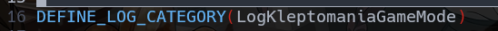

Use log in source:
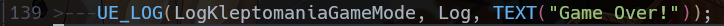

Filter the log category:

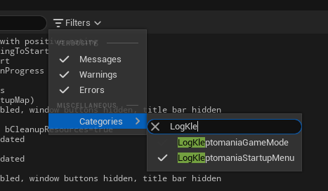

---

## Profiling
### Unreal stats

The `stat` util allows you to monitor special group of the data. Full list of the commands with descriptions can be found [here](https://docs.unrealengine.com/5.0/en-US/stat-commands-in-unreal-engine/)

For example `stat unit` - command. Displays the time for the main threads in game.

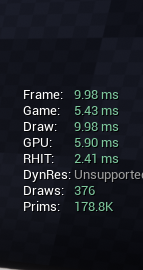

- `stat unit`:
  - `Frame` - time spent for the current thread
  - `Game` - time spent on the Game Thread
  - `Draw` - time spent to Render
  - `GPU` - time spent for the GPU

#### Custom measurements groups
UE allows you create custom stat group, for improving profiling
For create custom group you should use macros:
|Macros|Description|
|:--:|:--|
|`DECLARE_STATS_GROUP(GroupDesc, GroupId, GroupCat)`|Declares a stats group that is enabled by default.
|`DECLARE_STATS_GROUP_VERBOSE(GroupDesc, GroupId, GroupCat)`|Declares a stats group that is disabled by default.
|`DECLARE_STATS_GROUP_MAYBE_COMPILED_OUT(GroupDesc, GroupId, GroupCat)`|Declares a stats group that is disabled by default and which may be stripped by the compiler.

 - `GroupDesc` - text description of the group
 - `GroupId` - UNIQUE id of the group
 - `GroupCat` - reserved for future use
 - `CompileIn` - the compiler may strip it out if it is set to true

After that you can declare custom stat:

```c++
DECLARE_STAT(Description, StatName, GroupName, StatType, StatFlags, MemoryRegion)
```
 - `Description` - text description the stat
 - `StatName` - UNIQUE id of the stat
 - `GroupName` - the group id
 - `StatType` - type of the declaring stat
 - `StatFlags [EStatFlags]`
 - `MemoryRegion [EMemoryCounterRegion]`

Used enums:
```c++
// EStatFlags
enum class EStatFlags : uint8
{
    None            = 0,
    ClearEveryFrame = 1 << 0,
    CycleStat       = 1 << 1,
    Verbose         = 1 << 2, // Profiling scopes for this stat will no generate a trace event by default. See GShouldEmitVerboseNamedEvents.
};

// EMemoryCounterRegion
enum EMemoryCounterRegion
{
    MCR_Invalid, // not memory
    MCR_Physical, // main system memory
    MCR_GPU, // memory directly a GPU (graphics card, etc)
    MCR_GPUSystem, // system memory directly accessible by a GPU
    MCR_TexturePool, // presized texture pools
    MCR_StreamingPool, // amount of texture pool available for streaming.
    MCR_UsedStreamingPool, // amount of texture pool used for streaming.
    MCR_GPUDefragPool, // presized pool of memory that can be defragmented.
    MCR_PhysicalLLM, // total physical memory including CPU and GPU
    MCR_MAX
};
```

UE has an amount of predefined stats macroses:
|Method|Description|
|:--:|:--|
|DECLARE_CYCLE_STAT(CounterName, StatId, GroupId)|Declares a cycle counter stat.
|DECLARE_SCOPE_CYCLE_COUNTER(CounterName, StatId, GroupId)|Declares a cycle counter stat and uses it at the same time. Additionally, it is limited to one function scope.|
|QUICK_SCOPE_CYCLE_COUNTER(StatId)|Declares a cycle counter stat that will belong to a stat group named 'Quick'.|
|RETURN_QUICK_DECLARE_CYCLE_STAT(StatId, GroupId)|Returns a cycle counter, and is sometimes used by a few specialized classes.|
|DECLARE_FLOAT_COUNTER_STAT(CounterName, StatId, GroupId)|Declares a float counter, and is based on the double type (8 bytes).|
|DECLARE_DWORD_COUNTER_STAT(CounterName, StatId, GroupId)|Declares a dword counter, and is based on the qword type (8 bytes). |
|DECLARE_FLOAT_ACCUMULATOR_STAT(CounterName, StatId, GroupId)|Declares a float accumulator.|
|DECLARE_DWORD_ACCUMULATOR_STAT(CounterName, StatId, GroupId)|Declares a dword accumulator.|
|DECLARE_MEMORY_STAT(CounterName, StatId, GroupId)|Declares a memory counter the same as a dword accumulator, but it will be displayed with memory specific units.|
|DECLARE_MEMORY_STAT_POOL(CounterName, StatId, GroupId, Pool)|Declares a memory counter with a pool.|

More info can be found [here](https://docs.unrealengine.com/4.27/en-US/TestingAndOptimization/PerformanceAndProfiling/StatCommands/StatsSystemOverview)

##### Examples:
So, first things first, let's create a custom stat group:
```c++
DECLARE_STATS_GROUP(TEXT("SuperMegaStat"), STATGROUP_SuperMegaStat, STATCAT_Advanced)
```
So, why the `GroupCat` is `STATCAT_Advanced`. It's because of that. I thing it's represent the stat group categry here:

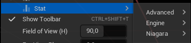

Next, compile and check. The `SuperMegaStat` should be in the **Advanced** category
Hmm... there is nothing.

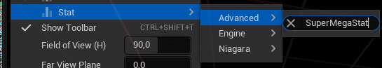

Ok, lets add some stat
```c++
DECLARE_DWORD_ACCUMULATOR_STAT(TEXT("Mega important counter"), STAT_ImportantCounter, STATGROUP_SuperMegaStat);
```
And that's it. Now we can see that we have our group in advanced category:

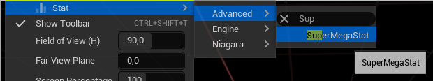

Add more stats [time and memory]:

Let's create a memory stat to track actors memory usage
```c++
DECLARE_MEMORY_STAT_EXTERN(TEXT("Spawned size"), STAT_SpawnedSize, STATGROUP_SuperMegaStat, );
```
Dont forget to define it in cpp file
```c++
DEFINE_STAT(STAT_SpawnedSize);
```

And then we can use it:
Like here:
```c++
// some_very_bigass_actor.cpp
// AHTUNG! The stat size will be displayed in MB

void SpawnBlahBlah()
{
    INC_MEMORY_STAT_BY(STAT_SpawnedSize, sizeof(AAccelerationItem));
}

void DestroyBlahBlah()
{
    DEC_MEMORY_STAT_BY(STAT_SpawnedSize, sizeof(AAccelerationItem));
}
```

So, now let's create an time stat. Imagine that we have some very complicated algorithm for item spawn, that depend of the Saturn location in space.
For that we need to use `Cycle Counter` stat type. Because of it's feature **to count the number of cycles during the object's lifetime**.
Firstly let's declare our stat. It's not gonna be globaly in our case so we can declare it in the target cpp source.
```c++
DECLARE_CYCLE_STAT(TEXT("Spawn next time"), STAT_SpawnNextTime, STATGROUP_SuperMegaStat);


void SpawnNext()
{
    SCOPE_CYCLE_COUNTER(STAT_SpawnNextTime);
}
```

For collecting data by condition use:
```c++
CONDITIONAL_SCOPE_CYCLE_COUNTER(STAT_StatsBroadcast,bSomeCondition);
```

Here is result:

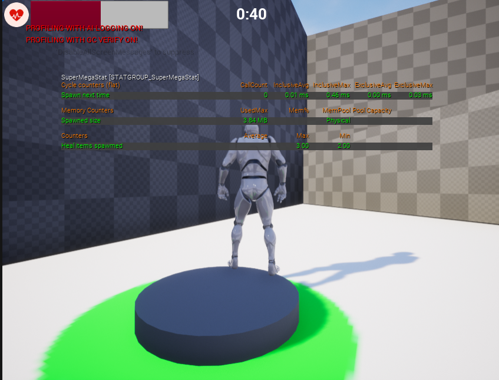


### Unreal FrontEnd
Session FrontEnd - tool used to monitor the performance of a game by collecting and tracking game data.
Session can be connected thourgh session browser window
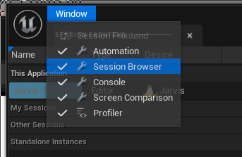

Or you can create session file by cmd using commands:
 - `stat startfile` - to start collect session data
 - `stat stopfile` - to stop collect

And then load the profile data
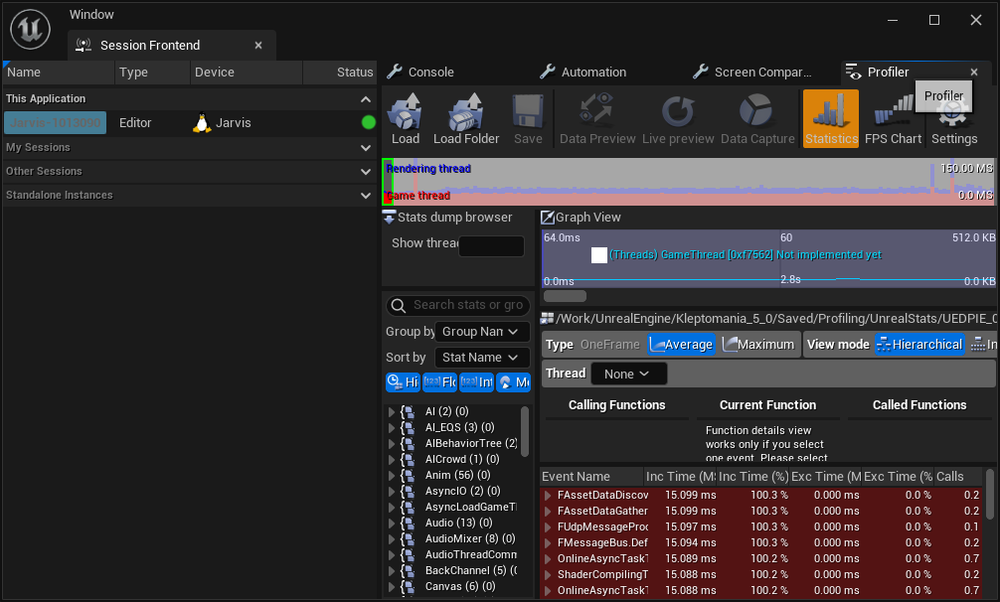

More information can be found [here](https://docs.unrealengine.com/4.27/en-US/TestingAndOptimization/PerformanceAndProfiling/Profiler/)

## Memory dump
For creating memory report run the command `memreport -full`
It will generate the .memreport file into YourGame/Saved/Profiling/MemReports
More info [here](https://www.unrealengine.com/en-US/blog/debugging-and-optimizing-memory)

Also you can use [Memory Insights](https://docs.unrealengine.com/5.0/en-US/memory-insights-in-unreal-engine/)

Very useful [video](https://youtu.be/Rf6oNkcGmX4) about Unreal Insights

Memory Insights example:
First you need to **Cook** your game
Then run game with the `-trace=memory` flag
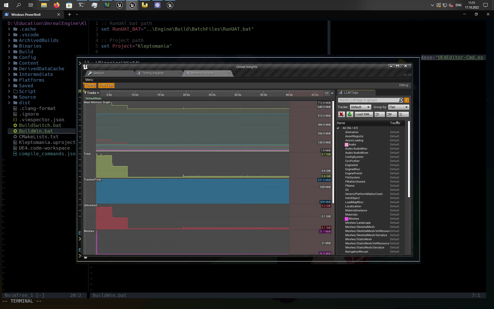

### LLM
Link about [LLM](https://docs.unrealengine.com/4.27/en-US/ProductionPipelines/DevelopmentSetup/Tools/LowLevelMemoryTracker/)

## Nintendo Profiling
To dump executable: Menubar -> Dump Executable

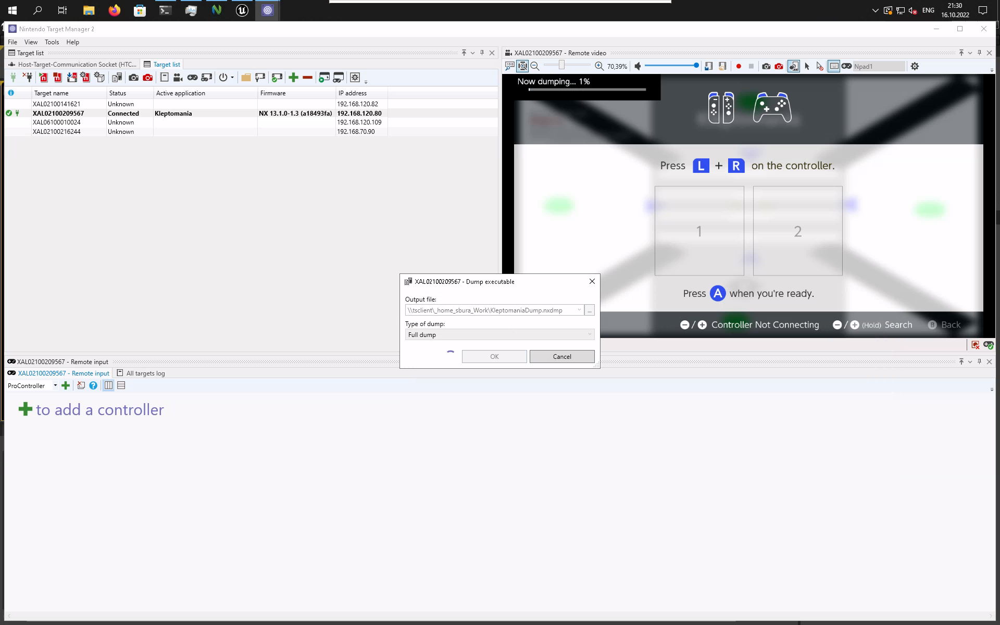

### NX CPU profiling

Base info can be found (Pingle VPN)[here](http://wiki.pingle/pages/viewpage.action?pageId=80019471)

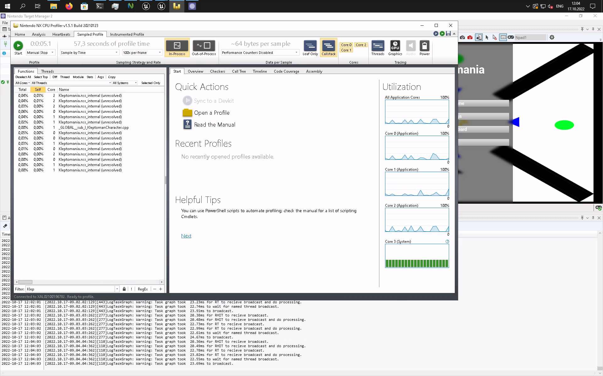


### NX GPU profiling


## Network Profiling
Info [here](https://docs.unrealengine.com/4.27/en-US/TestingAndOptimization/PerformanceAndProfiling/UnrealInsights/NetworkingInsights)

## Widget reflector
Widget debugger
 - [Unreal Docs](https://docs.unrealengine.com/4.27/en-US/ProgrammingAndScripting/Slate/WidgetReflector/)
 - [Basic features](https://youtu.be/a-FbDCgwHBU)

Usage:

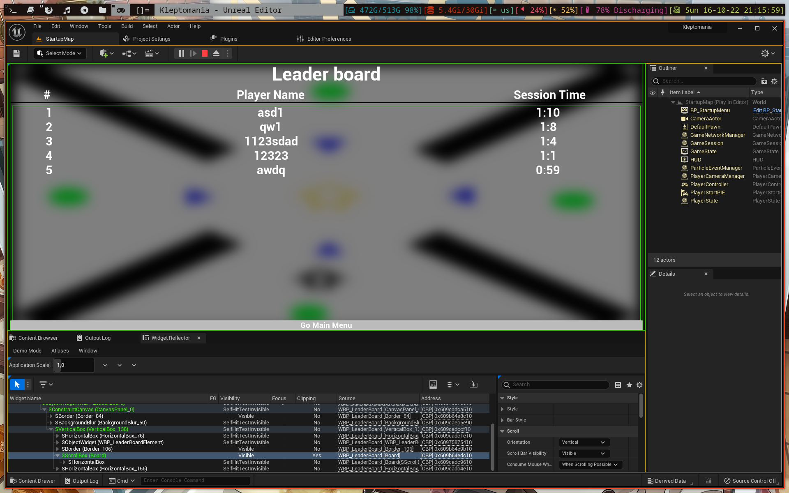

## Networking
[Doc](https://docs.unrealengine.com/4.26/en-US/InteractiveExperiences/Networking/Overview/)

[Network simulation settings](https://www.unrealengine.com/en-US/blog/finding-network-based-exploits)
